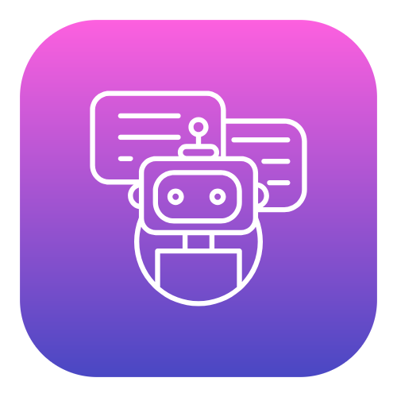

<p align="center">
  
</p>

# cute-agents-desk

<p align="center">
  
  
  <a href="LICENSE"></a>
</p>

[Español](README.md) | **English**

Local dashboard for dispatching command-line agents over the machine's repos and watching each
one's progress graphically.

Every new request spins up a **coordinator**: a real CLI agent, not server code — it decides how
many parallel sessions the work is split into, opens one per agent (delegating by file, never over
the network), receives their reports and keeps global control of the task. Two engines supported:
**`claude`** (Claude Code) and **`agy`** (Antigravity CLI), each with its own hooks — the card never
guesses status by reading the terminal.

## Key Features

- **Concurrency & Isolation via Git Worktrees:** Write-mode tasks never mutate the developer's primary working tree. Each worker (`claude` or `agy`) executes in an isolated, ephemeral `git worktree` with its dedicated semantic branch (`<engine>/<task>-<id>`), enabling true parallel execution without file lockups or branch collisions. Reaping completed worktrees is fully governed manually from Settings.
- **Observable PTY Terminals & Engine Telemetry:** Native integration with real pseudo-terminals (`node-pty`) completely sanitized of residual environment variables (`CLAUDE_*`). Real-time state tracking bypassing brittle terminal scraping: captures lifecycle events and tool invocations via engine-specific hooks. Automatically negotiates workspace trust dialogs strictly for folders formally verified by the active account.
- **Multi-Account GitHub Governance & Repo Discovery:** Automatic discovery and strict mapping of local workspaces bound to authenticated GitHub accounts (`accounts.json`). Prevents cross-account leaks and context bleed between personal and corporate profiles, enforcing workspace trust boundaries per registered path.
- **File-Based Decoupled Mailbox & Autonomous Coordination:** Asynchronous inter-process messaging utilizing disk-backed JSON queues (`events/`, `outbox/`) without exposing local TCP ports or network sockets. The coordinator agent delegates subtasks via atomic `spawn-requests`, while worker agents report lifecycle transitions (born, blocked, done, and arbitrary updates) directly into the coordinator's interactive PTY session.
- **Role Differentiation & Configurable Coordinators:** The coordinator operates by default inside the conversation mailbox (`conversations/<id>/`) orchestrating work without mutating source code, or over a custom, user-configured working directory (`cwd`) editable via native folder pickers. When creating a conversation or queuing an agent task, users can select or input the exact working folder, engine (`claude` or `agy`), model, reasoning effort, and execution mode. Worker agents execute specific implementation tasks inside isolated Git worktrees with 100% clean context, following a radial star topology (*hub-and-spoke*) where delegation never escalates privilege (*Delegation Never Escalates Privilege*). Includes a safe lifecycle with archived conversations segregated in the sidebar and permanent disk deletion guarded against active processes.
- **Automated Delivery Pipeline & Draft Pull Requests:** Robust, auditable delivery lifecycle upon task completion. Changes in the worktree are committed using the exact author identity (name and email) configured in `accounts.json`, securely pushed to `origin`, and registered via GitHub CLI as a draft Pull Request (`gh pr create --draft`) containing linked task reports and persisted audit trails in `deliveries.json`.
- **Resource Governance, Token Budgets & Parallelism Limits:** Integrated task scheduler (`scheduler.js`) enforcing strict concurrency ceilings globally and per conversation. Real-time telemetry tracking official subscription quotas directly from CLIs (`claude -p /usage` and `agy -p /usage`) with live weekly usage, 5-hour rolling windows, and reset timestamps, backed by local safety caps and defensive read-only policies (denylist for Claude Code vs. strict tool allowlist for Antigravity CLI).
- **Radial Workflow Topologies & Dependency Graph:** Dedicated "Workflows" tab rendering a radial SVG topology (`ui/boss-graph.js`) featuring the coordinator at the central hub with interactive live telemetry, orbiting worker nodes, and dynamic animated bezier curves representing prerequisite task dependencies (`dependsOn`) and context handoffs. Supports atomic conversation archiving and inactive session cleanup. Each node carries, when it applies, a read-mode lock badge and the outcome (✓/✗) of the last test/verify run it invoked; the "blocked" counter reflects calls the read-mode hook actually denied (not an estimate), and tasks the `Scheduler` is holding on a dependency or aborted in cascade show up as ghost entries in the parked row instead of staying invisible until they start.

### The two engines, in practice

`claude` and `agy` don't share a hook mechanism — each has its own, measured separately (exact
dates and versions live in the comments of `electron/agent.js`, `electron/hook.js` and
`electron/events.js`, not repeated here because they'd go stale):

| | `claude` | `agy` |
|---|---|---|
| Hook config | `--settings <file>`, any path | fixed at `<cwd>/.agents/hooks.json`, no flag |
| Process cwd | the repo (or its worktree, in write mode) | the agent's own directory in the harness — the repo comes in via `--add-dir` |
| Hook payload | snake_case (`tool_name`, `tool_input`) | camelCase (`toolCall.name`, `stepIdx`) |
| Per-worktree isolation | yes | yes — `--add-dir <worktree>` with hooks in harness |
| Tokens / cost | live statusLine | no known equivalent — no token cap for agy |
| Read-only mode | denies `Edit\|Write\|NotebookEdit` (blocklist) | allows only confirmed read-only tools (allowlist) — stricter on purpose, because agy's full tool surface was never enumerated |

## Prerequisites

- **Windows 10 or 11 (64-bit)**
- **Node.js 20+** and **npm**
- **Git** configured in system `PATH`
- **GitHub CLI (`gh`)** authenticated (`gh auth status`)
- CLI Engines (at least one installed and available in `PATH`):
  - **Claude Code (`claude`)**
  - **Antigravity CLI (`agy`)**

## Run and Package

```bash
npm install
node node_modules/electron/install.js
npm start
```

The second line is needed because npm blocks postinstall scripts, so `npm install` leaves the
Electron package without its binary.

Other available commands:
- `npm run dev`: Starts the application with DevTools opened.
- `npm run smoke`: Headless window smoke test (validates rendering of 6 tabs with 0 errors).
- `npm run dist`: Builds the portable Windows executable (`CuteAgentsDesk-0.1.0-portable.exe`) and NSIS installer in `dist/`.
- `npm run icon`: Compiles the Windows application icon (`assets/icon.ico`) from `assets/icon.png`.
- `npm run rebuild`: Rebuilds native dependencies (`node-pty`) against Electron's internal headers.

## Verify

Every piece of plumbing has its own `tools/verify-*.js`, all following the same convention — live
runs against a real `claude`/`agy` only where a mock can't prove the point (hook
isolation, read-only mode, the full `agy` engine), and pure `node:assert` unit tests for
state-machine logic (token cap, scheduler, conversations, mailbox draining).

```bash
npm test        # runs the 31 fast scripts that need no real CLI and no window, in one shot
npm run smoke   # the whole window, no agents: 6 tabs, 0 errors
```

`npm test` (`tools/verify-all.js`) runs the 31 `verify-*.js` scripts MEASURED to finish in
seconds under plain `node`. The rest need a real CLI turn, an Electron window, or packaged
binary verification (`verify-dist-binary.js` after `npm run dist`). Those stay manual, run one at a time:

```bash
node tools/verify-dist-binary.js                                     # validates packaged executable in dist/
npm run verify:claude                                                # a real claude agent, end to end (tools/verify-claude-live.js)
npm run verify:agy                                                   # the same, with agy (tools/verify-agy-live.js)
npx electron tools/verify-read-mode.js
npx electron tools/verify-hook-isolation.js
npx electron tools/verify-coordinator-e2e.js
```

For test philosophy, virtual harness architecture, and step-by-step authoring guidelines, see [docs/testing-guidelines.md](docs/testing-guidelines.md).

## How it's built

No build step. The window loads `ui/` over an `app://` protocol instead of `file://`: the renderer
is ES modules, and `file://` gives them a null origin, so the browser rejects every `import`.
`app://` is a real origin and nothing outside the process can reach it, so there's no port or token
to guard either. Fonts live in `ui/fonts/`: nothing is fetched over the network.

### Backend (`electron/`)

| File | What it does |
|---|---|
| `main.js` | The window, the `app://` protocol, the registry of live agents and every `ipcMain.handle` |
| `preload.js` | The full surface the renderer can ask of the machine — readable at a glance |
| `agent.js` | `spawn()`: a real PTY per agent, env sanitizing, the trust dialog, each engine's hook schema |
| `hook.js` | What the CLI invokes on every event; tells each engine's payload apart and decides whether to deny a tool in read-only mode |
| `pty-env.js` | The sanitized environment — the reason launching the harness from inside a Claude session doesn't break `--resume` |
| `paths.js` | Where every harness file lives — a text editor is the first debugging tool |
| `git.js` | Safe wrapper with synchronous and asynchronous (`gitAsync`) Git operations, preventing main thread freezing during scans |
| `json-queue.js` | Core file-based JSON queue mechanics (`drainJsonQueue`, `watchJsonQueue`) for inboxes and spawn-requests |
| `tool-name.js` | Tool name normalizer between Claude Code (`snake_case`) and Antigravity (`camelCase`) |
| `events.js` | `Registry`: hook → state, the worker↔coordinator mailbox, `status.json`, the token cap |
| `worktree.js` | Per-`git worktree` isolation for write-mode tasks (`claude` and `agy`) with semantic branch naming |
| `delivery.js` | Delivery pipeline: account identity, commit dirty worktree files, safe push to origin, and draft PR (`gh pr create --draft`) |
| `scheduler.js` | Concurrency caps and acyclic task orchestration (DAG with DFS cycle detection and fail-fast cascade) |
| `conversations.js` | A conversation is a folder: `conversation.json`, `status.json`, `agents/` |
| `coordinator.js` | The coordinator's prompt and the draining of its `spawn-requests` |
| `config.js` | Hardened configuration store (`config.json`): canonical defaults, deep merge, prototype pollution guards, numerical bounds clamping, and atomic replacement |
| `discovery.js`, `accounts.js` | Real repo discovery by GitHub account, with mismatch detection, hierarchical relative paths and canonical disk resolution |
| `scheduled-tasks.js` | Read-only discovery of Claude Desktop's and Antigravity's scheduled tasks on this machine, with interactive execution log inspection |
| `skills.js` | Discovers installed skills across Claude and AGY directories, reads `SKILL.md` content, and computes token impact estimates |
| `quotas.js` | Non-interactive background runner with strict timeouts, Windows process tree termination (`taskkill`), and 60-second TTL caching for Claude and AGY `/usage` |
| `toy-repo.js` | The toy repo that the live `tools/verify-*.js` scripts use |

### Frontend (`ui/`)

| File | What it is |
|---|---|
| `app.js` | State, the six tabs and a single delegated event handler |
| `data.js` | The data seam: per field, mocks until a real source exists — never both at once |
| `sidebar.js` | The real conversations sidebar |
| `tokens/` | Pastel-Tech design system tokens, plus `app.css` for the ones only this application uses |
| `app.css` | Reset, animations and shared controls |
| `esc.js` | Pure utility for safe HTML entity escaping against string injection in templates |
| `robot.js` | The robot, defined once and parameterized by state |
| `ring.js` | The token ring and its formatters |
| `repo-tree.js`, `agent-card.js`, `terminal.js` | "Agent control" tab: hierarchical collapsible directory tree with real-time bubble-up indicators, status filtering, and task queuing |
| `boss-graph.js` | "Workflows" tab |
| `visualizer.js`, `highlight.js` | "Visualizer" tab: unintegrated change tree, approval diff with lightweight syntax highlighting and external editor launch |
| `tokens-view.js` | "Usage" tab: live telemetry, engine/account splits, measured rate, and official CLI subscription quotas |
| `scheduled-tasks-view.js` | "Scheduled Tasks" tab: what Claude Desktop and Antigravity have scheduled, with interactive log inspector |
| `config.js`, `dialogs.js`, `chat.js` | "Settings" tab, modal inspectors (`SKILL.md`, cron logs, Explorer reveal), and agent Card/Thread/Diff panel |

### Web Showcase (`website/`)

The repository includes a standalone landing page in `website/index.html` featuring the Pastel-Tech design language and an interactive SVG automata simulation of agent state machines.

Two conventions worth respecting when editing:

- **No literal colors in JavaScript.** Every color comes from a CSS custom property. A new value
  gets named in `ui/tokens/app.css`.
- **Components are pure functions** that return an HTML string. Interaction is declared with
  `data-act` and `data-arg` attributes; actions live in `ui/app.js`.

One gotcha: inside an inline SVG, `stroke="var(--x)"` is silently ignored. It has to be written as
`style="stroke:var(--x)"`.

## Movement means something

An agent's status reads through color **and** movement, two redundant channels on purpose: what
moves is progressing, what's still is stopped. A blocked agent has a dashed red border and doesn't
animate; a graph edge with running lines is a working session. With `prefers-reduced-motion` the
whole panel stays still, and color and labels still carry the same meaning.

## Key Architectural Learnings

1. **ConPTY Environment Sanitization on Windows:** In Windows environments, invoking a CLI harness inside an existing terminal session causes child processes to inherit residual environment variables (`CLAUDE_*`). Explicitly purging these variables before `pty.spawn()` is mandatory to prevent session state corruption and silent failures on flags like `--resume`.
2. **Non-blocking Asynchronous Git Operations:** Offloading heavy repository introspection queries to asynchronous functions (`gitAsync`) ensures the Electron renderer maintains a smooth 60 FPS refresh rate, preventing large Git histories from stalling Node's main loop.
3. **Decoupled File-based IPC Mailbox:** The worker-to-coordinator messaging mechanism operates via on-disk JSON file queues (`events/` and `outbox/`). This avoids opening exposed TCP network sockets or local WebSocket ports, reducing the local attack surface to zero while offering persistence across process restarts.
4. **Allowlists vs. Denylists for AI Tool Isolation:** In read-only mode, a denylist (`Edit|Write`) suffices for tools with a closed capability set (Claude Code), but fails for engines that expose arbitrary execution capabilities (`agy`). For the latter, the only secure defense-in-depth model is strictly inverting the evaluation to a closed allowlist of verified read-only tools (`view_file`, `list_dir`, `grep_search`, `find_by_name`).
5. **Git Worktree Isolation:** When executing tasks in write mode, directly mutating the developer's working tree is unsafe. Each write agent provisions an isolated temporary worktree and branch (`agent/<id>`) in a dedicated directory, keeping the primary workspace untouched until changes are reviewed and approved.
6. **Atomic Configuration Persistence and Prototype Pollution Defense in Desktop Runtimes:** Storing user preferences (`config.json`) using temporary buffers with process entropy nonces (`nonce = ${pid}.${Date.now()}.${random}`) and atomic filesystem replacements (`renameSync` with copy fallback) prevents 0-byte truncations during sudden power interruptions or crashes. Concurrently, strictly purging dangerous prototype properties (`__proto__`, `constructor`, `prototype`) and clamping numeric boundaries (`maxParallel: [1..20]`) neutralizes Denial of Service vectors or *fork bombs* before they can reach the process scheduler.
7. **Hierarchical Directory Virtualization & Canonical Path Disambiguation:** In multi-account enterprise setups, flattening nested repositories under declared roots leads to unmanageable UI lists and silent process dispatch failures when resolving working directories (`cwd`). Converting flat collections into an on-demand N-level collapsible directory tree with single-pass metric accumulation ($O(N)$) and canonical absolute path tracking prevents dispatch collisions across identically-named repositories (e.g. `domain/infra` vs `core/infra`) while keeping rendering instant.
8. **Safe Bounded I/O Consumption & Context Estimation in System Tools:** When exposing interactive inspection of on-disk engine artifacts (`SKILL.md` and live sidecar logs), reading unbounded files into memory risks freezing the main Node thread on oversized or malformed files. Enforcing strict file-descriptor buffers (clamped to 64 KB for `SKILL.md` and bounded tail-window reads for `.log` streams), neutralizing executable extensions prior to invoking `shell.openPath`, and finite horizon lookaheads (14-day projection limit for cron evaluation) guarantees that developer inspection remains instant, resilient, and immune to memory exhaustion or main-thread stalls.

